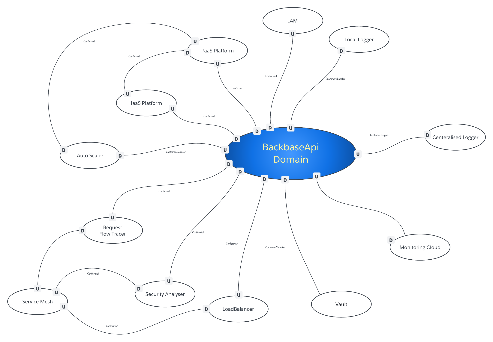
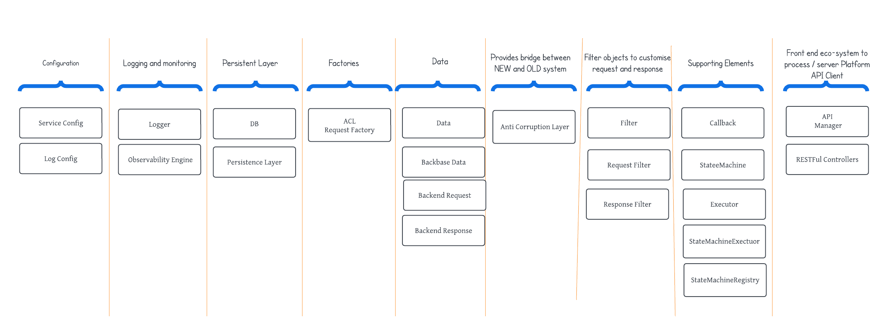
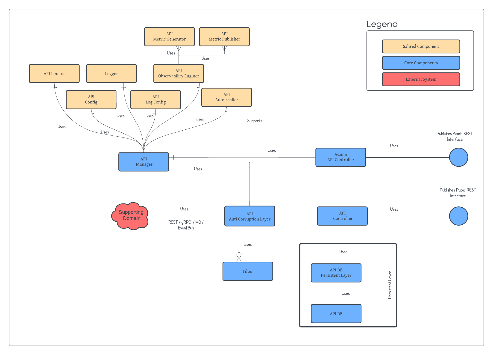
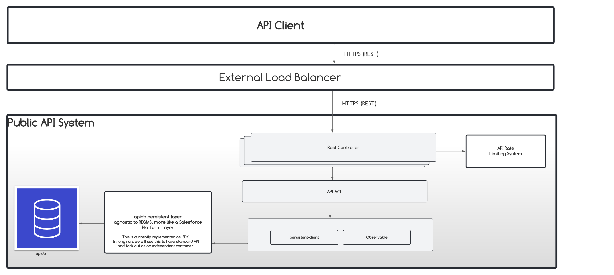
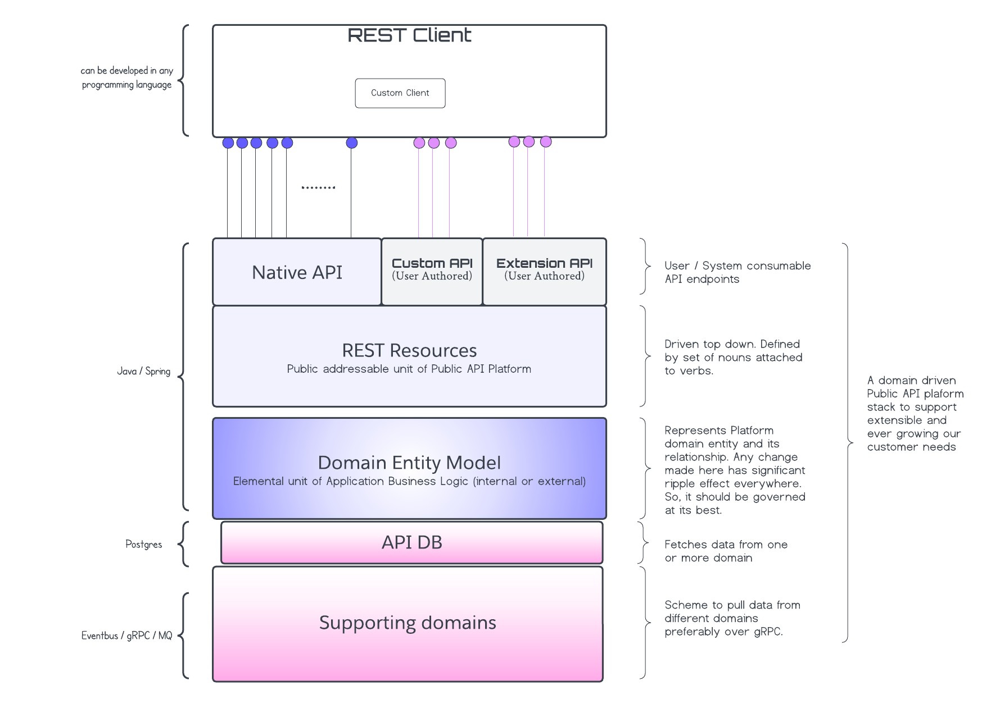
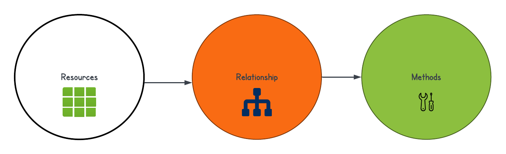
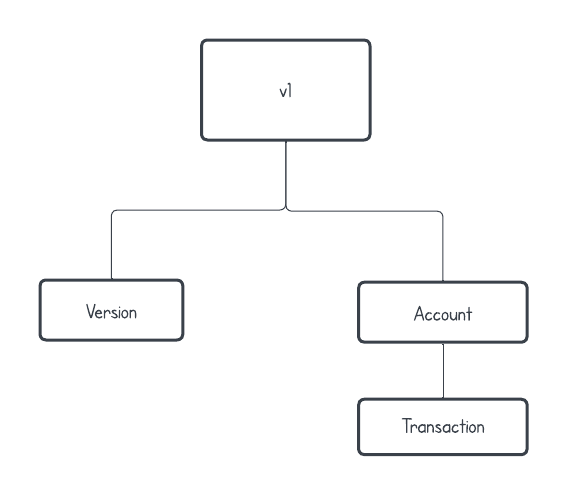

# Overview

# Architectural Style
Any product can be designed with any architectural style. Also, every architectural style choice has its pros and cons. Also, any architectural style can be challenged at any time with certain points as no architectural style is sufficient to serve all cons. Otherwise, the entire development
generation might have picked that.  E.g.

- Monolith is very highly performant (still the best choice for embedded systems) but comes with a lot of pain of refactoring, difficulty to make a change, and difficult to measure. Anyone working on such a system may not do this!
- 2-tier architecture comes with the simplest model but has its cons when it comes to scalability, building a distributed system, performance and so on.
- Domain Driven Design comes with the benefit of self-intuitiveness but requires a good amount of expertise and knowledge of constructs like microservice, Kubernetes, design patterns and so on.

So, every style is a best-fit model driven by task, situation and current development paradigm. For our product, we choose DDD because it's a close ally for cloud-native applications following a micro-services pattern. Keeping this style, this section defines some of the artefacts resulting as
part of the process of following this style:

- [Bounded Context](#bounded-context)
- [Domain Elements](#domain-elements)
- [Domain Element Relationship](#domain-element-relationship)
- [Domain Model](#domain-model)

### Bounded Context

### Domain Elements

### Domain Element Relationship

### Domain Model

# Architecture

This section lays out logical architecture of Public API System as depicted below. 

Also, it explains its constituents and external interface as described in the below table.

| Component              | Description                                                                                                                                | Deployable                                                |
|:-----------------------|:-------------------------------------------------------------------------------------------------------------------------------------------|:----------------------------------------------------------|
| API Client             | Anyone performing REST calls can be developed in language. It must adhere to API specification                                             | Depending on client's eco-system                          |
| External Load Balancer | An external component to distribute API calls across multiple deployable units of API                                                      | Yes, but out of the purview of the Backbase API component |
| API System             | Responsible for performing RESTful operation as per its specification                                                                      | Yes                                                       |
| Rest Controller        | An internal component (entry point) for any rest request.                                                                                  | No independent deployment (is part of API System)         |
| Anti-corruption Layer  | An internal component helping in the realisation of all requests sent by the REST Controller. It is responsible for talking to the backend | No independent deployment (is part of API System)         |
| Persistent Client      | An internal component required to interact with DB                                                                                         | No independent deployment (is part of API System)         |
| Database               | An independent persistence system supporting storage and retrieval of API data                                                             | Yes                                                       |

The above architecture can be realised by using the below stack.

# Backbase API RESTful Resource Identification 

The Backbase API's approach is to identify the resources, the relationship, and then the methods.  To archive that the following points have been taken care of.

- Usage or resource model
- Allow flexibility in API layers to be able to navigate up and down the resource,
- Keep the REST method simple and standard and focused on the resources eliminating complex naming conventions and point-to-point methods.

API design will be Resource Model centric instead of relying heavily on any physical implementation. The change in the business layer implementing various concepts of business, data models, and algorithms implementing business logic is imminent. At the same time, it is very important to provide stable, extensible and agile API which does not require consumers to adopt new versions very frequently is a critical ask. And, creating a constant interface for the aspect ever-changing is a changing task. If not done thoughtfully, API consumption patterns are going to get affected, hence monetising its value. The goal is to adhere to 3 steps approach depicted below.

The advantages of choosing this process are the following:

- Prevents redefining the data every time we make an API. Service concepts are quickly changing and they will be used in many implementations from events to APIs to NOSQL databases.  Having a resource model where we can “drag and drop” the resource, as opposed to redefining it for every implementation will save time on the design and build while removing complex mappings and transformations that tend to become massive technical debt.
- Not bound to a physical model.  Swagger, RAML, YAML, GraphQL, WADL, XSD, JSON etc have all been part of the API ecosystem for some time.  By maintaining a resource model at the logical level you can support the different physical implementation styles.  Managing resource models at the physical level is possible in one format but it will not translate well into implementation styles (XSD to JSON for example).  It will help us to be open to using the latest standards and not get mired down in format-to-format mappings use a resource model that is independent of those formats.
- Increased chances of adoption. The usage of One API layer that represents the resource and allows for numerous contextual boundaries whether they are system-based, process-based, or business-based is an ideal approach. Otherwise, the shape of the legacy contexts will proliferate to the API layers, eventually requiring change very frequently,
- Empowering the developer community.  Resource model provides developer with a leadership role as the integration teams can expect the transformations to be aligned to the resource model as opposed to a best-guess approach that may include out-of-date or misleading elements
- Avoid technical debts by designing resources on the fly. This is the pattern we do follow as of today. It increases the chances are there will be gaps between what we build and how the API consumer understands our view of the resource.  It will eventually lead to a scenario where adoption will be poor and technical debt will increase.
- Simplified API. We will be adhering mature resource model that defines the structure of the resource including the definition of what the data represents at a very fine-grained level.

Keeping this philosophy in mind, the following resource model graph is identified.

TODO: PUT A TABLE DESCRIBING RESOURCE 

# Low Level Design 

### Sequence Diagram 
### Class Diagram
### Error Reporting

# Low Level Design Future Consideration 

As you can see that there is no change in architecture but the way these components are going to serve scenarios is an important thing to be considered especially for resource creation and update scenarios. It leads to a huge set of new requirements or challenges at the fundamental level which our system should be able to sustain.

> Note that the section enlists high-level challenges which are written in the context
> API but might be applied generically. So, the discussion will also reflect
> its generic nature which readers need to keep in mind. For scenario specific details.

In any interaction where one or more of the above-listed participants misbehaves or does not perform as expected, we are going to face an erratic situation, especially in the CUD path of CRUD operations. The common challenges we see are the following.

- [Synchronous vs. Asynchronous](#synchronous-vs-asynchronous)
- [Transaction](#transaction)
- [Component failure](#component-failure)
- [Partial Successful Transaction](#partial-successful-transaction)
- [Latency](#latency)
- [RBAC](#rbac)

### Synchronous vs. Asynchronous

This section is more about how we do deal with POST/DELETE/PUT (selectively) operations which might take longer than what is acceptable for an API caller. Should we do synchronous like GET? Or, should we provide URI as someone performs POST / PUT / DELETE which can be monitored by the client to see operation status? Effectively, we are left with the following design choices which are well-understood and explored in industry. Let us evaluate them.

| Choices                                                         | Pros                                                                                                                                                                                                                                                                                                                                 | Cons                                                                                                     |
|-----------------------------------------------------------------|:-------------------------------------------------------------------------------------------------------------------------------------------------------------------------------------------------------------------------------------------------------------------------------------------------------------------------------------|:---------------------------------------------------------------------------------------------------------|
| Synchronous call for all CRUD operations                        | Let everything be a synchronous call even for POST/PUT/DELETE operations.  In this case, no URI is needed to be generated to track the progress of the requested operation.   Simple implementation  Request timeout which is as good as API failure or sometimes worse than that. No extra investment in framework                  | Client gets blocked unless it plays smart                                                                |
| Asynchronous call for time-consuming POST/PUT/DELETE operations | Adhere to the industry standard mechanism of generating status *URI* which the client needs to track to get the success or failure result of the requested operation. A full-proof operation for POST / PUT / DELETE scenarios especially when the required operation is going to be time-consuming Requires investment in framework | Incurs development cost. Also, it  requires the client to track status of uri provided by the API server |

### Component failure

The failure is imminent and so is component failure. So far, the failure of GET calls would have affected only client behaviour, which was reasonably accepted as a client might have applied retry logic or could have tried the same request after some time. Have not we seen it commonly?

> Server is down, please try after some time!

Now, it is not so because the failure of a component can lead us to a partial/dirty write scenario or keep the client in guess mode. It all depends on what fails at what time. This section is more about how we do deal with the failure of POST/DELETE/PUT operations.  Let us enlist and evaluate them.

It is important to note down the traditional flow of any requests: API → Backend → Persistent Layer. All our conversations will be based on this interaction flow. Failure of the component means that the underneath component succeeded unless stated otherwise explicitly. So, failure of the Backend means that the communication between the Backend → Persistent Layer was successful unless stated otherwise.

### Partial Successful Transaction

API will provide batch operation for many resources. It is imperative that the GET/POST/PUT/DELETE operation might not always be successful at the batch level. The reason can be one of the following:

1. Batch request was having input error
2. Component failed while performing certain operation

We do not see a situation where we provide batch responses to clients partially. So, we will not be dealing with this. Let me know if you think otherwise

Let us evaluate them.

1. A batch request succeeded. In this case, everything work as expected
2. A batch request got accepted but all inputs were invalid. *No issue with Backend Service.*
3. A batch request failed partially because the system failed to serve certain inputs *when the API server is dealing with* *only one backend service.*
4. A batch request failed partially because the system failed to serve certain request *when the API server is dealing with* *more than one backend service (a composite operation) and one of the Backend failed to perform the desired task because of input/request error only* Let us assume that a batch request contains 3 input I1, I2 and I3. Also, all of the processing of input does not require _*composite interaction*_ with more than one backend. *Because of some reason one of the Backend servers fails to process certain inputs. In this case, we need to ensure that a composite operation is successful or rolled back. We can not or should not leave the system with partial data in one backend.*
5. A batch request failed partially because the system failed to serve certain request *when the API server is dealing with* *more than one backend service (a composite operation) and one of the Backend failed to perform desired task*  

### Latency

As we build POST / PUT / DELETE API and that too with the ability to perform batch calls, it is important to keep response time in mind. The response time is very-very valid as delayed response might cause a lot of issues to client workflow. So, we need to do a good job in the following aspects:

1. Mechanism to measure latency
2. Mechanism to emit logs reflecting latency if it cross a certain limit
3. Building timeout protocol
4. Measuring latency with an average load

In this section, we will talk about different scenarios related to latency and our strategy to deal with it.

| ID  | Category                | Scenario                                                                                                                                                                 | Description                                                                                                                                           | User expectation                                                                                  |
|:----|:------------------------|:-------------------------------------------------------------------------------------------------------------------------------------------------------------------------|:------------------------------------------------------------------------------------------------------------------------------------------------------|:--------------------------------------------------------------------------------------------------|
| 1   | API Server Slowness     | API takes more than 500ms.                                                                                                                                               | Should API Server respond with a timeout message?                                                                                                     | In this case, we might not be technically failing but we are failing to serve client requirements | Do whatever it takes but respond within 500ms.
| 2   | Backend Server Slowness | API talks to multiple backends but one of the backends is taking longer than anticipated.  No retry performed at the API server level so far. Should API Server timeout? | In this case, everything is fine but one of the backends is taking longer time, may be because of retry or slowness of the system itself              | Do whatever it takes but respond within 500ms.                                                    |
| 3   | Backend Server Retry    | API talks to multiple backends but one of the responses from the backend fails. Should we retry at again backend level?                                                  | Everything is fine! However, one of the backends failed because of some reason, not sure why. The question is whether API Server should retry or not. | Do whatever it takes but respond within 500ms.                                                    |
| 4   | Display API latency     | User wants to know detail about latency either through metric or log analysis.                                                                                           | Need a way to know details of latency data.                                                                                                           | Do whatever it takes but respond within 500ms.                                                    |

### RBAC

We are building a set of APIs which imperatively creates a schema. Yes, we are talking about substrate API. It makes an important question to ask ourselves, do we want to allow all CRUD operations to be performed on all resources for anyone who authenticates to the API server? It is important from the following angle:

1. How do prevent data corruption? How can we prevent GET /service users to manoeuvre POST /substrate
2. Why POST/PUT/DELETE should be available to all users? Why should not we restrict this to specific tenant types or specific sets of user groups?

We mustn't need to support RBAC. Let us talk about more here.

| Id  | Choices                                               | Description                                                                                                                                                                          | Pros                                                    | Cons                       |
|:----|:------------------------------------------------------|:-------------------------------------------------------------------------------------------------------------------------------------------------------------------------------------|:--------------------------------------------------------|:---------------------------|
| 1   | Make everything accessible once you get authenticated | As of now, we use the JWT token for authentication. Once you get authenticated, you get complete rights to all operations including POST / PUT / DELETE calls on all resources. Hmm! | Simple implementation. No extra investment in framework | Data corruption likelihood |
| 2   | Support RBAC for respective API sets                  | Provide specific user groups only to access specific operations on certain API    Brings RBAC    Extra investment is required. Prevents data corruption knowingly or mistakenly      | Extra investment is required                            |                            |
