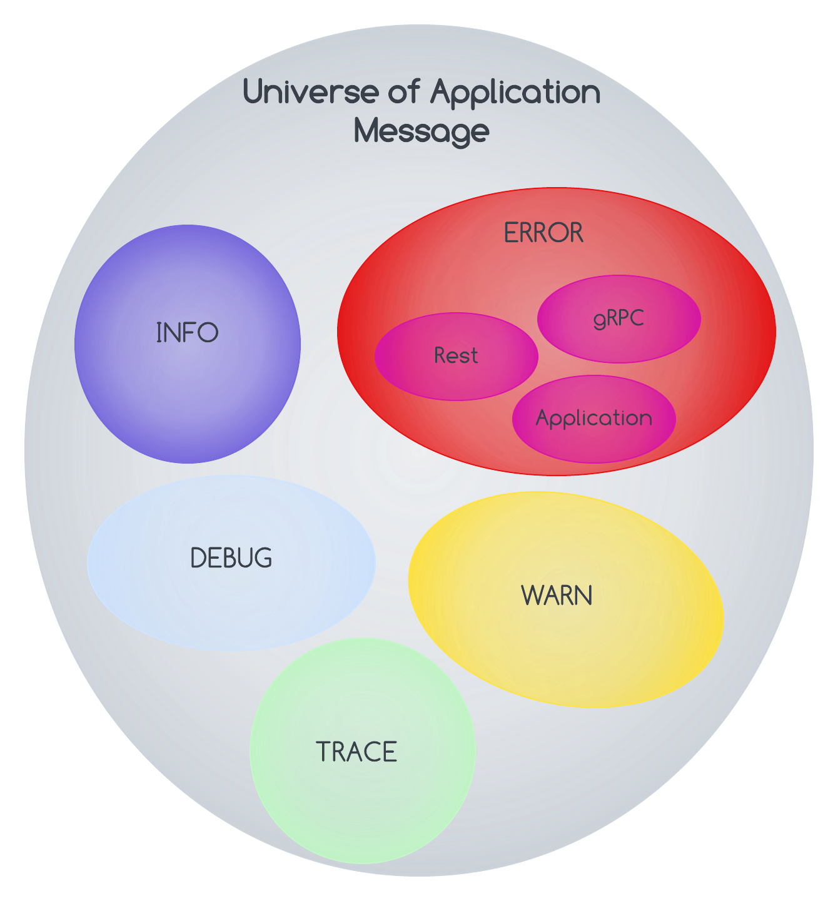

# Overview

If you're here, you're likely concerned with making your user-facing products as delightful as possible. And, messaging plays an important role in that. Having useful messages can go a long way toward making a frustrating scenario for an end-user as pleasant as possible. In a perfect
world, messages would be redundant and users would be able to use anything you've built a-okay, no problem. But errors will happen, and your end-users will run into them. These errors can
stem from:

* Failing validation
* Server-side failures
* Rate limiting
* Broken code
* Acts of god

And when things go wrong, often the client-facing error messaging takes shape in one of two ways:

Generic errors with no meaningful information, e.g. Something went wrong, please try again later

> Hyper-specific messages from the stack trace sent by the server, e.g. Error 10x29183: line 26: error mapping Object -> Int32

Neither are helpful for our end-users. For our users, the generic error can create a feeling of helplessness and frustration. If they get such a message, they can't complete an action and have no way of knowing why the error happened and how (or if) they can resolve it. This can result in
loss of end-user trust, loss of customers, or an angry review. On the other hand, hyper-specific error messages are a leaky abstraction and shouldn't be seen by our end-users eyes. For one, this kind of error provides implementation information about our server-side logic. Is this a
security concern? probably? I'm no pen-tester. Secondly, if we're in the business of crafting engaging user experiences, (and why wouldn't you be?) our error messages should feel human and be service-oriented. This is a sentiment shared in several resources I've come across, many
of which I've included in a further reading section at the end.

This document plays a guiding role in how we engineer our services to be more user-friendly.

- Application logging
- REST API Error Handling

# Application logging

A log is a file that records the communications between a system and its users that records the type, content, and time of transactions made by a person from a system terminal. This section talks about best practices for logs to be emitted by services. Exception hierarchy and Log
message might seem related, but not so. It seems too primarily related because we print log statements once we get an exception. But the correlation stops there! Exception hierarchy is meant to raise an error when one can not handle the message. So, its usage is only for error
scenarios. Yeah, a purist might say this is not 100 per cent true. For now, we will not discuss the purist aspect. However, a Log message is about emitting messages in a standardised format with proper codes. Also, it is even used to report Info, Warn or Error messages. See message universe
below:

### Guideline

The intent is to achieve the following logging guideline.

- Every application should be configured with standard and the same log configuration.
- Every log should be pushed to a centralised log.
- Every log should be categorised into the following groups: Debug, Info, Warn, and Error.
- Every log other than Debug should have a standard message published, including the following.
    - Pre-defined Message Code
    - Pre-defined Message String
    - Message arguments (if possible as part of Message String)
- Every log other than Debug should look up a message from the pre-defined single source of message inventory instead of cooking and randomly publishing the message. This is critical as we want to bring a culture of well-published, pre-defined standard logs identified by unique code. See Oracle Error Code as an example code mechanism that helps us in the following ways:
    - Recognise the message by code
    - Automate reading/parsing / performing selective action based on the code
    - Categorising code to represent specific types of errors

### What not to do?

- Scattering messages into different classes or source
- Deferring the decision of identifying a category too late in the application development process
- We are not reserving enough messages for a given category.
- Not having a reserved set of categories for future extensions. It does not discourage doing (2) but asks to do (2) as much as possible but plan for extensibility.

# REST API Error Handling

REST is a tremendous and industry-accepted protocol for performing resource-based operations. It is an excellent example of client-server technology. However, a set of errors is bound to happen, and it is essential to have a common approach to providing users with relevant information. A few examples are:

1. Client
    - The client asked for an invalid resource
    - The client asked for a resource list in which some resources are invalid
    - The client asked for valid help but provided input data was not correct, sort of incorrect information
    - The client failed to authenticate
      -The client tried to access a resource for which they are not authorised
2. Server error
    - The server failed to communicate its subsystem to perform the desired operation
    - The server gained because of an unknown reason
    - The server can not accept request more than it can chew at this point (often known as the throttling period)

So, we all understand the importance of REST API Error handling and the role of custom error messages. Let us touch base on a different aspect of it:

* [HTTP Status Codes](#http-status-codes)
* [Custom error message](#custom-error-message)
* [Approach](#approach)
* [Message response](#message-response)

### HTTP Status Codes

| Code | Type          | Meaning                                                                                                                                                       |
|:-----|:--------------|:--------------------------------------------------------------------------------------------------------------------------------------------------------------|
| 100s | Informational | Server acknowledges a request                                                                                                                                 |
| 200s | Success       | Server completed the request as expected                                                                                                                      |
| 300s | Redirection   | Client needs to perform further actions to complete the request. Or, the server returned when a new resource has been substituted for the requested resource. |
| 400s | Client error  | Client sent an invalid request                                                                                                                                |
| 500s | Server error  | Server failed to fulfil a valid request due to an error with the server.                                                                                      |

### Custom error message

The 4xx HTTP status codes may not be enough to describe the cause of the error to the client. For this reason, Backbase API has introduced a custom error response format to provide the caller with everything they need to deal with the error.  To summarise, it means returning additional
data along with the HTTP error status code.

For example, imagine a situation where an API requires a numeric transaction_limit parameter. Now, a client calls that API without the transaction_limit parameter which is invalid. As a result, it will receive a generic 400 Bad Request error from the server. The default "Bad Request" message does not help the client know how they should call the API.
On the other hand, if the server returned a 400 HTTP status code response containing the "transaction_limit required" or `service_id must be a UUID` message, the client could figure out how they need to call the API properly and avoid making the same mistake twice. So, it is
important to drop these messages making them client-friendly.

> Do not overdo this!
> Notice that customizing error responses represent a security concern. Although providing extra
> info in case of errors can be helpful, you should never return information that could jeopardise
> the security of your application. This is why you should consider customization on error
> responses only on 4xx errors, which are all directly referable to the client. On the contrary,
> you should never provide additional info on your 5xx error responses.

### Approach

Every 4xx should return the response body as described below. Do not return custom messages for
5xx scenarios. This section highlights how we can achieve so by adhering to the following
practices:

1. Define application message code structure, which should be comprised of the following
    - Message code
    - Message
2. Leverage (1) in defining response for any and every custom 4xx error
3. Document and publish error codes
4. Make every client of REST API return the message information as per the Message response

Step (1) should be used in application logging as well.

### Message response

The proposed structure for API error messages are:

`{
"errors": [
{
"message": "Authentication failed due to incorrect username or password.",
"type": "Authentication",
"code": K0000019020,
"help": "See error code article"
}
]
}`

A description of the element of the above message is given below.

| Key     | Description                                                                                                                                                                                                                                                                                                           |
|:--------|:----------------------------------------------------------------------------------------------------------------------------------------------------------------------------------------------------------------------------------------------------------------------------------------------------------------------|
| errors  | List of errors. We want to be flexible in providing a list of errors wherever possible to be more informative.                                                                                                                                                                                                        |
| message | *The ** message ** portion of the body is usually considered presentable on user interfaces. ** *Therefore, we should translate this title if we support internationalization. So if a client sends a request with an Accept-Language header corresponding to French, the title value should be translated to French. |
| type    | It tells the category of message code, and helps the client in making interpretation easy,                                                                                                                                                                                                                            |
| code    | It should be an error code unique to our application. Generally, there is no convention for the error field, except that it is unique.                                                                                                                                                                                |
| help    | Usually, this field contains only alphanumeric and connecting characters, such as dashes or underscores. For example, 0001, auth-0001 and incorrect-user-pass are canonical examples of error codes.                                                                                                                  |
